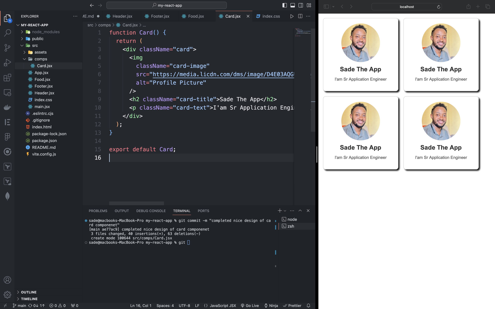

# React + Vite

This template provides a minimal setup to get React working in Vite with HMR and some ESLint rules.

Currently, two official plugins are available:

- [@vitejs/plugin-react](https://github.com/vitejs/vite-plugin-react/blob/main/packages/plugin-react/README.md) uses [Babel](https://babeljs.io/) for Fast Refresh
- [@vitejs/plugin-react-swc](https://github.com/vitejs/vite-plugin-react-swc) uses [SWC](https://swc.rs/) for Fast Refresh

# ReactJS

## Card Componenet

## Styling ReactJS

- Inline
- External
- module

## Props

- read-only properties that are shared between components.
- A parent component can send data to the child component
- eg <Component key=Value />

- PropTypes: a mechanism that ensures the passed value is of the correct datatype.
- eg. age = PropTypes.number

- defaultprops:default values for props in case they are not passed from the parent componenet.
- eg name= "Guest"
